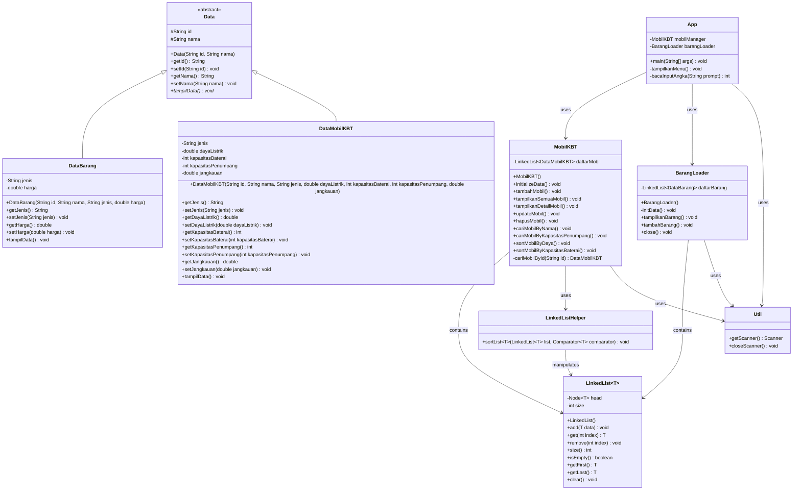

# Manajemen Data Barang dan Mobil KBT

Aplikasi berbasis Java untuk mengelola data barang dan mobil KBT (Kendaraan Bertenaga Listrik) menggunakan implementasi struktur data Linked List.

## Struktur Proyek

```
Proyek Java
├── App.java                # Program utama yang menjalankan aplikasi
├── Data.java               # Kelas dasar abstrak untuk menyimpan informasi umum
├── DataBarang.java         # Kelas turunan dari Data untuk data barang
├── DataMobilKBT.java       # Kelas turunan dari Data untuk data mobil KBT
├── BarangLoader.java       # Kelas untuk memuat dan mengelola data barang
├── MobilKBT.java           # Kelas untuk memuat dan mengelola data mobil KBT
├── LinkedList.java         # Implementasi struktur data Linked List
├── LinkedListHelper.java   # Kelas pembantu untuk operasi-operasi khusus pada Linked List
└── Util.java               # Berisi fungsi-fungsi utilitas umum untuk mendukung aplikasi
```

## Deskripsi Kelas

### App.java
Kelas utama yang menjalankan aplikasi dan menampilkan menu interaktif untuk pengguna.

### Data.java
Kelas abstrak dasar yang digunakan untuk mendefinisikan atribut dan metode umum untuk semua jenis data.

### DataBarang.java
Kelas yang mewakili data barang, turunan dari kelas Data. Memiliki atribut tambahan seperti jenis barang dan harga.

### DataMobilKBT.java
Kelas yang mewakili data mobil KBT, turunan dari kelas Data. Memiliki atribut khusus seperti daya listrik, kapasitas baterai, kapasitas penumpang, dan jangkauan.

### BarangLoader.java
Kelas yang mengelola daftar barang menggunakan LinkedList. Menyediakan fungsi untuk menampilkan dan menambah data barang.

### MobilKBT.java
Kelas yang mengelola daftar mobil KBT menggunakan LinkedList. Menyediakan berbagai fungsi seperti menambah, menampilkan, memperbarui, menghapus, mencari, dan mengurutkan data mobil.

### LinkedList.java
Implementasi struktur data Linked List yang digunakan untuk menyimpan dan mengelola koleksi objek.

### LinkedListHelper.java
Kelas pembantu yang menyediakan fungsi-fungsi tambahan untuk manipulasi LinkedList, seperti pengurutan.

### Util.java
Berisi fungsi-fungsi utilitas umum seperti pengelolaan input/output untuk mendukung aplikasi.

## Diagram Hubungan Antar Kelas

Berikut adalah diagram kelas untuk proyek ini yang menunjukkan hubungan antar kelas:



Keterangan hubungan antar kelas:
- **Inheritance (Pewarisan)**: `DataBarang` dan `DataMobilKBT` mewarisi `Data` sebagai kelas abstrak induk
- **Dependency (Ketergantungan)**: 
  - `App` menggunakan `MobilKBT`, `BarangLoader`, dan `Util`
  - `MobilKBT` dan `BarangLoader` menggunakan `LinkedList` dan `Util`
  - `LinkedListHelper` memanipulasi `LinkedList`
- **Composition (Komposisi)**:
  - `MobilKBT` memiliki koleksi objek `DataMobilKBT` dalam `LinkedList`
  - `BarangLoader` memiliki koleksi objek `DataBarang` dalam `LinkedList`

## Alur Program

1. Program dimulai dari metode `main()` di kelas `App`
2. Inisialisasi objek `MobilKBT` dan `BarangLoader`
3. Menampilkan menu utama kepada pengguna
4. Berdasarkan pilihan pengguna, program akan memanggil fungsi-fungsi yang sesuai:
   - Menampilkan, menambah, memperbarui, atau menghapus data mobil KBT
   - Mencari mobil berdasarkan nama atau kapasitas penumpang
   - Mengurutkan data mobil berdasarkan daya listrik atau kapasitas baterai
   - Menampilkan atau menambah data barang
5. Program terus berjalan hingga pengguna memilih untuk keluar

## Fitur

- Manajemen data mobil KBT (tambah, tampil, perbarui, hapus)
- Pencarian data mobil berdasarkan nama dan kapasitas penumpang
- Pengurutan data mobil berdasarkan daya listrik dan kapasitas baterai
- Manajemen data barang (tambah, tampil)
- Implementasi struktur data Linked List kustom

## Cara Menjalankan

1. Pastikan Java Development Kit (JDK) telah terinstal di sistem Anda
2. Kompilasi semua file Java:
   ```
   javac *.java
   ```
3. Jalankan aplikasi:
   ```
   java App
   ```

## Dikembangkan Oleh

Andre Christian Saragih

---

*Program ini dibuat sebagai proyek untuk mempelajari implementasi struktur data Linked List dalam aplikasi Java.*
